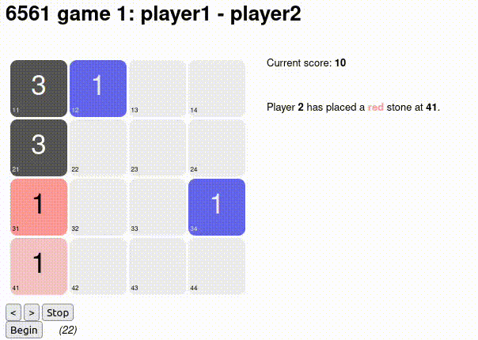
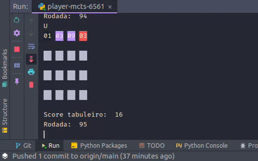

# Jogo 6561 (Variante do 2048)

## Sobre o projeto.

Projeto realizado na disciplina de Inteligência artificial ministrada por [Hendrik Macedo](https://www.sigaa.ufs.br/sigaa/public/docente/portal.jsf?siape=2527554).

O projeto consistem na escolha de um dos jogos listados no site da [CodeCup](https://www.codecup.nl/archives.php), uma plataforma que organiza
competições de jogos.

Escolhemos o jogo [6561](https://archive.codecup.nl/2016/). 
O jogo possui a seguinte dinâmica:
O score é apenas a soma de todas as peças no tabuleiro.

1. O primeiro jogador _(chamaremos de jogador A)_ escolhe uma coordenada para inserir uma peça de **cor vermelha** no tabuleiro _(em uma coordenada vazia)_;
2. O segundo jogador _(jogador B)_ escolhe outra coordenada vazia para inserir uma segunda peça de **cor azul** no tabuleiro;
3. Jogador 'A' insere uma terceira peça no tabuleiro, agora de **cor cinza**;
4. Jogador 'B' escolhe um movimento de giro: pode ser **cima, baixo, esquerda e direita**;
5. Jogador 'A' escolhe também um dos movimentos de giros citados à cima;
6. Esse processo se repete até que as não haja casa para inserir peças ou o tabuleiro esteja completamente vazio durante as rodadas. _(na competição só é permitido ir até 1000 rodadas para somar pontos)_.

## Regras do jogo:
1. Ao girar o tabuleiro para um dos lados escolhidos _(cima, baixo, esquerda e direita)_ as peças podem ser combinadas ou apagadas;
2. Peças de mesma cor e mesmo valor são substiuidas por uma única peça com o valor original multiplicado por 3;
3. Peças com mesmo valor e cores diferentes se mutilam _(desaparece do tabuleiro)_.

Para ver a lista completa das regras do jogo [clique aqui](https://archive.codecup.nl/2016/42/rules_6561.html).

Veja um demo da dinâmica do jogo. _(Player 1 jogando cooperativamente com Player2)_

## O objetivo do projeto:

1. Escolher um dos jogos listados no link apresentado acima (escolhemos o [6561](https://archive.codecup.nl/2016/);
2. Modelar o jogo;
3. Configurar o servidor da competição _(disponibilizado pela Codecup para cada jogo)_;
4. Criar um agente inteligente (IA) que consiga jogar e maximizar pontos.

## Técnica de IA utilizada para o projeto.
Escolhemos o método de [Monte Carlo](https://pt.wikipedia.org/wiki/M%C3%A9todo_de_Monte_Carlo) com o critério [UCT](https://www.chessprogramming.org/UCT) para modelar nosso
agente.

## Realizando as simulações com a IA
Aqui estamos realizando experimentos com a IA para encontrar um valor ideal para a contatante de _Exploration_, profundidade e simulações de Monte Carlo.
Observe os testes em execução.

   
## Run local
1. Intalar as dependencias
   2. `pip install numpy`;
   3. `pip install colorama`.
   
2. Executar o projeto
   1. `python3 player-mcts-6561.py`.

## Run servidor caia _(necessário apenas na competição)_
- Rodar comando `dos2unix player-mcts-6561.py` na própria pasta do git;
- Copiar esse mesmo arquivo para pasta bin do caia;
- Renomear através do comando `mv player-mcts-6561.py player1`;
- Dar permissão de execução: `chmod +x player1`.

### Referências
- `Russell, Stuart J. Artificial intelligence a modern approach. Pearson Education, Inc., 2010.`
- `BROWNE, Cameron B. et al. A survey of monte carlo tree search methods. IEEE Transactions on Computational Intelligence and AI in games, v. 4, n. 1, p. 1-43, 2012.`
- [Ai-boson](https://ai-boson.github.io/mcts/)